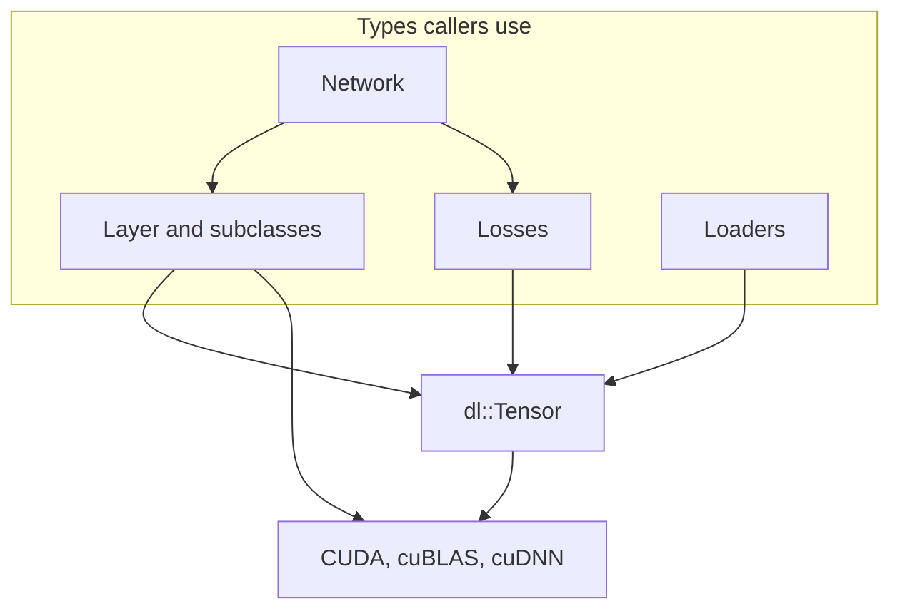

# DeepLearnLib

Public API of the core library (`include/DeepLearnLib/`, `src/`). This manual stops at the types you call. Epoch loops, dataset schedules, and Custom-vs-Torch binaries are in [Usage](../usage/README.md).

| Page | Subject |
| --- | --- |
| [Overview](overview.md) | What the library owns, and the class diagram |
| [Tensor](tensor.md) | Storage, views, `ensure`, GEMM |
| [Layers](layers.md) | `Layer` and every subclass |
| [Losses](losses.md) | `YOLOLoss`, `CrossEntropyLoss`, `MSELoss` |
| [Loaders](loaders.md) | How a `Batch` is produced |
| [Utilities](utilities.md) | `Network`, precision, profiler, mAP, logging |
| [Extending](extending.md) | Adding a layer |
| [Build](build.md) | Configuring and compiling the library |
| [Conventions](conventions.md) | Names and the exceptions |

Dependency direction inside the library:

`YOLO` and `SimpleCNN` are not in this diagram. They live in `DeepLearnModels` and are documented under Usage.
