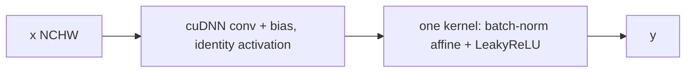

# Layers

`Layer` is the extension point. A subclass implements:

- `forward(x)` returns `y`. The tensor may alias an internal cache. It is invalid after another `forward` of the same layer.
- `backward(dy)` returns `dx`. Parameterised layers also write `dW` and `db` into members.
- `step()` reads those gradients and updates parameters. Layers without parameters leave it empty.
- `train()` / `eval()` select dropout and batch-norm behaviour.
- `freeze()` makes `step()` a no-op for that layer.
- `get_parameters()` / `set_parameters()` expose named tensors for `Network::save` and `Network::load`.

Optimiser fields live on the layer: `learning_rate`, `momentum`, `weight_decay`, `gradient_clip`. `scaled_learning_rate()` divides the learning rate by the mixed-precision loss scale. `parameter_clip_bound()` scales the clip the same way, so an FP16 backward and the update stay in one numeric regime.

Weight decay is applied inside `sgd_update_` / `sgd_momentum_update_`, not inside `backward`. `backward` is only the derivative.

With `momentum == 0` the update is vanilla SGD. `gradient_clip == 0` disables clipping. A positive clip is an absolute bound on the value that enters the update.

## Backends

| Class | Implementation | Parameters | `train` vs `eval` |
| --- | --- | --- | --- |
| `Conv2d` | cuDNN convolution | weight, bias | same math |
| `BatchNorm2d` | cuDNN spatial batch-norm | gamma, beta, running mean and variance | batch stats vs running stats |
| `FusedCBR2d` | cuDNN conv+bias, then one kernel for the batch-norm affine and LeakyReLU | conv weight and bias, gamma, beta, running stats | same split as batch-norm |
| `MaxPool2d` | cuDNN max pooling | none | same math |
| `FullyConnected` | `matmul_into` | weight `[F_in, F_out]`, bias `[1, F_out]` | same math |
| `LeakyReLU` | device kernel | none | same math |
| `Dropout` | device Bernoulli mask | none | mask while training, identity in eval |
| `Flatten` | `Tensor::view` | none | same |
| `Softmax` | cuDNN accurate softmax, channel mode | none | same math |

## `Conv2d`

NCHW in, NCHW out. Kernel, stride, and padding are fixed at construction. Tensor, filter, and convolution descriptors are rebuilt when the input shape changes. Forward and backward use the cuDNN convolution API. The workspace size reported by cuDNN is stored with `ensure`.

Bias is a separate tensor. Standalone `Conv2d` adds it with cuDNN's tensor add. `FusedCBR2d` folds bias into `cudnnConvolutionBiasActivationForward` with an identity activation, so the following normalisation still sees a linear pre-activation.

## `BatchNorm2d`

Spatial batch-norm over NCHW: one mean and variance per channel. Gamma and beta are `[1, C, 1, 1]`, matching `cudnnDeriveBNTensorDescriptor` for `CUDNN_BATCHNORM_SPATIAL`.

In training the layer updates running mean and variance and keeps the batch mean and inverse variance for `backward`. In eval it uses the running statistics and does not update them. Epsilon defaults to `1e-5`. The batch-norm momentum defaults to `0.1`. That momentum is the running-stat blend. It is a different field from `Layer::momentum`, which is SGD.

## `FusedCBR2d`

Convolution, bias, batch-norm, and LeakyReLU as one layer.



Convolution stays in cuDNN. The custom kernel starts where a separate LeakyReLU would read the activation back from global memory. `backward` differentiates the leak, the normalisation, then `Conv2d`. `step` updates the convolution parameters and gamma and beta. Running statistics are included in `get_parameters`, so a checkpoint restores eval behaviour.

## `MaxPool2d`

cuDNN backward needs the forward input and the forward output, so both are cached. Window and stride are constructor arguments.

## `FullyConnected`

```text
Y = X W + b
X is [N, F_in], W is [F_in, F_out], b is [1, F_out]
```

Forward writes `X W` with `matmul_into`, then `add_row_(b)`.

Backward uses logical transposes:

- `dW = X^T dY` with `transpose_a`;
- `db` is the row sum of `dY`;
- `dX = dY W^T` with `transpose_b`.

The third constructor argument, `inertia`, is the GEMM `beta` used when writing `dW` and `db`. `0` replaces the gradient buffer. It is not SGD momentum. SGD momentum is `Layer::momentum`.

`step` calls `sgd_update_` or, when momentum is non-zero, `sgd_momentum_update_`. The velocity buffer is allocated on the first momentum step and then reused.

## `LeakyReLU`

`y = x` when `x >= 0`, otherwise `slope * x`. The default slope is `0.1`. Forward caches the input so backward can scale the negative side.

## `Dropout`

Inverted dropout. In training, kept values are scaled by `1 / (1 - p)`, so eval is the identity and does not rescale. The mask is cached for backward. The default probability is `0.5`.

## `Flatten`

View from `[N, ...]` to `[N, F]` and back. No kernel and no parameters.

## `Softmax`

`CUDNN_SOFTMAX_ACCURATE` subtracts the max before the exponential. `CUDNN_SOFTMAX_MODE_CHANNEL` normalises across the channel dimension.

`CrossEntropyLoss` already applies softmax inside the loss and the gradient. A training step that uses that loss passes logits and does not backpropagate through this layer.
