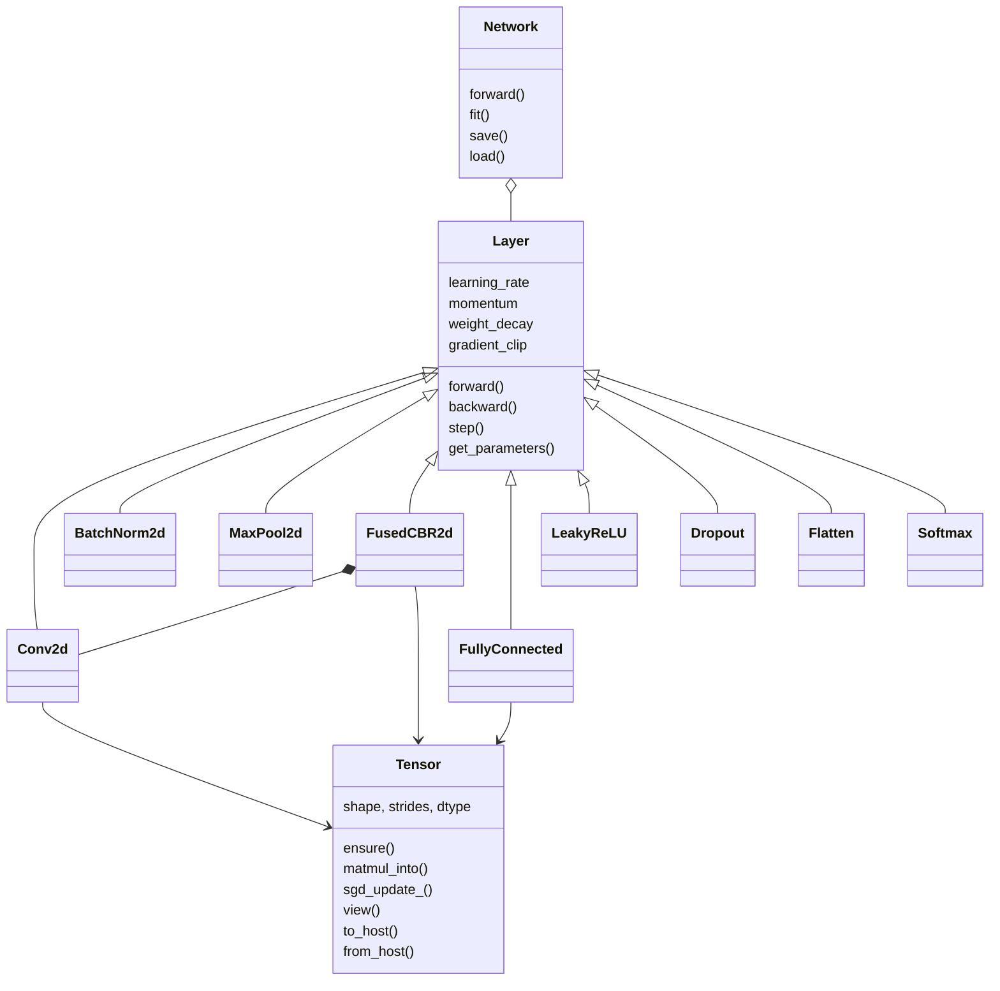

# Overview

DeepLearnLib is a C++17 / CUDA library. It allocates device memory, runs convolution, pooling, and batch-norm through cuDNN, runs dense products through cuBLAS, and implements elementwise work and the detection loss as its own kernels.

It does not build a computation graph. Each operation is a class with `forward` and `backward`. It does not contain a detector or a classifier topology. Those are assembled by applications from the layer types below.

## What is in the library

| Area | Headers | Role |
| --- | --- | --- |
| Storage | `Tensor.hpp`, `Precision.hpp`, `SafeMath.hpp` | Dense arrays, FP32/FP16 policy, numeric guards |
| Layers | `Layer.hpp`, `Conv2d.hpp`, `BatchNorm2d.hpp`, `FusedCBR2d.hpp`, `MaxPool2d.hpp`, `FullyConnected.hpp`, `LeakyReLU.hpp`, `Dropout.hpp`, `Flatten.hpp`, `Softmax.hpp` | Trainable and activation blocks |
| Losses | `YOLOLoss.hpp`, `Losses.hpp` | Scalar loss and `dL/dpred` on the device |
| Loaders | `dataset.hpp`, `ClassificationLoader.hpp`, `PackedImageLoader.hpp`, `CSVLoader.hpp` | Host samples to a GPU `Batch` |
| Glue | `Network.hpp` | Ordered layers, gradient clip, parameter file |
| Measurement and I/O helpers | `Profiler.hpp`, `mAP.hpp`, `utils.hpp`, `Logger.hpp`, `Nvtx.hpp` | Timers, detection scores, NMS, logs |

cuBLAS and cuDNN are used as the GEMM and convolution implementations. The library's own code is buffer ownership, descriptor setup, fusion, and the kernels NVIDIA does not ship for this loss.

## Class diagram

Infrastructure types sit in namespace `dl`. Layers, losses, loaders, and `Network` sit in the global namespace. That split is described in [Conventions](conventions.md).

`FusedCBR2d` owns a `Conv2d` and adds batch-norm scale and shift plus LeakyReLU. `BatchNorm2d` remains available on its own.

## Handles and errors

`dl::CublasContext` and `dl::CudnnContext` are process-wide. The cuBLAS workspace is allocated once. `dl::StreamGuard` sets `dl::current_stream()` for a scope and restores the previous stream on exit. `dl::bind_cudnn_stream` points the cuDNN handle at that stream.

`CHECK_CUDA`, `CHECK_CUBLAS`, and `CHECK_CUDNN` throw `std::runtime_error` with file and line. A missing cuDNN fails configuration. There is no CPU implementation of the training ops.
