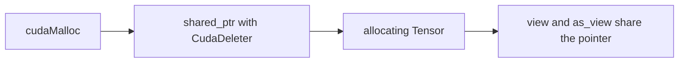

# Tensor

`dl::Tensor` is a dense row-major array. Training storage is on the GPU. Host buffers and device storage are IEEE-754 `float` (`dl::Dtype::Float32`).

## Ownership



`CudaDeleter` calls `cudaFree`. CPU tensors use `CpuDeleter`. Staging copies use `PinnedHostDeleter` (`cudaFreeHost`). A view copies the `shared_ptr`, the shape, and the strides. The last owner frees the buffer. Tensors are movable and not copyable.

`from_host` uploads a contiguous host buffer. `to_host` copies back and synchronises the given stream before returning. Both cross the host/device boundary. `forward` and `backward` do not call them.

`dl::UniqueCudaStream` creates a non-blocking stream and synchronises it in the destructor.

## `ensure`

```cpp
dl::Tensor& slot = dl::Tensor::ensure(cache_, shape, dl::Device::GPU, dtype);
```

`cache_` is a `std::optional<dl::Tensor>` owned by the caller, usually a layer. `ensure` allocates when the slot is empty or the shape, device, or dtype differs. Otherwise it returns the existing buffer. Layers return `slot.as_view()` so the caller observes the data without a device-to-device copy.

A stable shape therefore allocates on the first call and reuses that storage afterwards. Activations and cuDNN workspaces stay resident for the process.

## Layout and views

Images are NCHW. A fully-connected activation is rank 2, `[N, F]`. `Flatten` is a view from `[N, ...]` to `[N, F]`; `backward` views the gradient back to the cached input shape.

`transpose()` allocates a new tensor. `matmul_into` does not need that copy: a `transpose_a` or `transpose_b` flag becomes `CUBLAS_OP_T`, so cuBLAS reads the existing layout as a transpose.

## GEMM

`matmul` allocates its result. `matmul_into` writes into a buffer the caller already owns:

```text
C = op(A) * op(B) + beta * C
```

`beta = 0` overwrites `C`. The cuBLAS handle uses `cublasGemmEx` with `CUDA_R_32F` and `CUBLAS_COMPUTE_32F_FAST_TF32`.

## In-place arithmetic

These methods write through the existing pointer:

| Method | Effect |
| --- | --- |
| `add_`, `mul_`, `add_scaled_` | Elementwise update |
| `add_row_` | Add a `[C]` or `[1, C]` bias to every row of `[N, C]` |
| `add_sum_rows_` | Reduce `[N, C]` into a bias gradient |
| `clamp_` | In-place clip |
| `sgd_update_` | `w -= lr * clip(g + decay * w)` |
| `sgd_momentum_update_` | `v = mu * v + clip(g + decay * w)`, then `w -= lr * v` |

The trailing underscore means the tensor is modified. That is the same spelling PyTorch uses for in-place ops. `Layer::step` calls one of the SGD methods. It does not allocate `w - lr * g`.

`dl::safe_sqrt`, `safe_div`, and `guarded_div` keep square roots and divisions off exact zero. `DEBUG_NUMERICS` scans for NaN and Inf after layer passes. The scan synchronises, so the CMake option stays off for timing runs.
