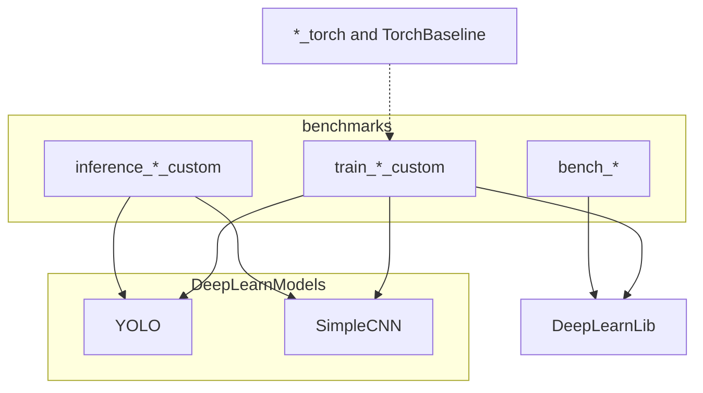

# Using DeepLearnLib

Applications live in `benchmarks/` and `torch_baseline/`. They construct layers, run epoch loops, and write metrics. The types they call are documented in the [library manual](../library/README.md). This manual does not repeat kernel contracts.

| Page | Subject |
| --- | --- |
| [Models](models.md) | `YOLO`, `SimpleCNN`, and the tabular MLP, with shapes |
| [Training](training.md) | What a binary does each step, and where the two CUDA streams are |
| [Experiments](experiments.md) | Pipelines, CSV columns, micro-benchmarks |
| [Measurements](measurements.md) | Thesis table copied from a local GPU run |
| [Running](running.md) | Docker, the menu, plots |

`DeepLearnModels` is a static library of `benchmarks/models/YOLO.cpp` and `SimpleCNN.cpp`. Training binaries link it plus `DeepLearnLib`. The tabular MLP is local to `train_tabular_custom.cpp` and does not go through `DeepLearnModels`.

Optional `*_torch` binaries link `TorchBaseline` (`torch_baseline/`). They are the timing baseline. They are not part of `DeepLearnLib`.

Binary names are `{role}_{dataset}_{stack}`: roles `train`, `inference`, `bench`, `short`, `overfit`; stack `custom` or `torch`. The matching JSON key is in `config/experiments.json`.
