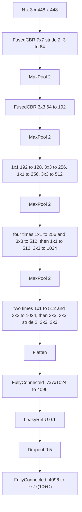
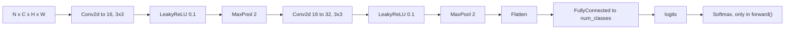
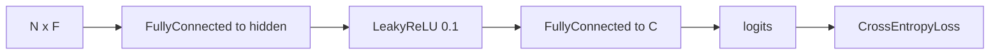

# Models

Models are ordered lists of library layers plus a `forward`. `get_all_layers()` is the list the training loop walks backward and the list `Network` saves. Input images are NCHW float in `[0, 1]`.

Layer behaviour (fusion, GEMM, dropout) is in [Layers](../library/layers.md).

## `YOLO`

`YOLO(num_classes)` in `benchmarks/models/YOLO.cpp` is a YOLOv1 detector: 24 convolutional layers, each a `FusedCBR2d` (convolution, batch-norm, LeakyReLU with slope `0.1`), four max-pools, and a two-layer head. Input is `448×448`. The head predicts two boxes and `num_classes` scores on a `7×7` grid.

The original YOLOv1 paper does not put batch-norm in every block. This class does. `torch_baseline/TorchYOLO.cpp` uses the same conv–batch-norm–LeakyReLU stack, so the Custom and Torch binaries train the same topology.

Spatial size for a 448 input:

| After | Side |
| --- | --- |
| 7×7 stride-2 convolution | 224 |
| pool | 112 |
| 3×3 convolution and pool | 56 |
| the next four convolutions and pool | 28 |
| the middle stack and pool | 14 |
| 3×3 stride-2 convolution and the two convolutions after it | 7 |

The head tensor is flat `[N, 7*7*(10+C)]`. Both linear layers are constructed with inertia `0`. `num_classes` changes only the last layer and the loss width. VOC uses 20, BCCD uses 3, the synthetic set uses 3.

`forward` binds the cuDNN handle to the caller's stream and views each intermediate tensor before the next layer.

## `SimpleCNN`

`benchmarks/models/SimpleCNN.cpp`. CIFAR-10 uses it with 32×32 RGB. MNIST uses it with the spatial size and channel count stored in the packed file (28×28, 1 channel).

For 32×32 the flatten width is `32 × 8 × 8 = 2048`. The constructor computes it from `image_size`.

`forward_logits` is what training and `CrossEntropyLoss` call. `forward` appends `Softmax` when the caller wants probabilities. Softmax is not in `get_all_layers()`, so `backward` does not walk it. There is no batch-norm and no dropout in this network.

## Tabular MLP

`train_tabular_custom.cpp` builds the network inline:

`hidden_size` and `num_classes` come from the pipeline JSON. A separate `Softmax` is held in eval for reporting and is not on the backward path. If the CSV is missing, the binary writes a small synthetic file and continues.

## Inference binaries

`inference_*_custom` loads a checkpoint with `Network::load`, calls `eval()`, and runs `forward`. Detection binaries decode the grid with `conf_threshold` and `nms_threshold` from the JSON. Classification binaries take argmax of the logits and can write a confusion matrix and sample predictions (`classification_eval.hpp`, `classification_vis.hpp`).

Decoding happens after `to_host` of the prediction. It is host work on top of the library's `decode_yolo_tensor` and `apply_nms`.
