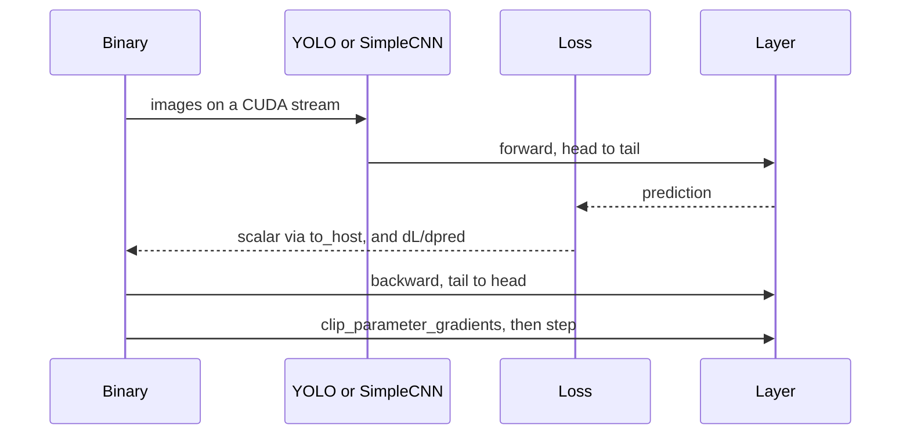
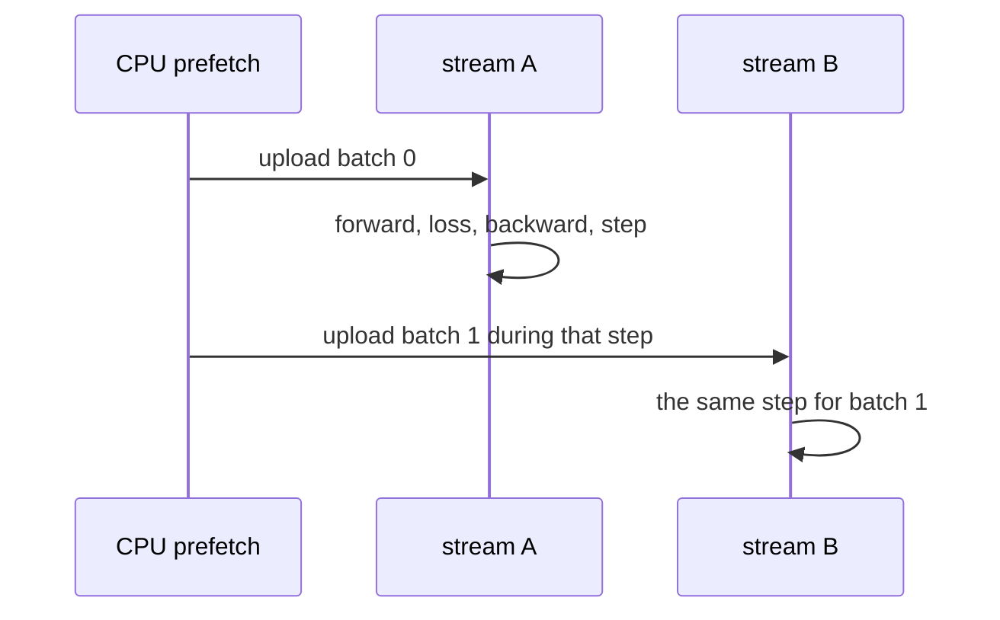

# Training loops

Every Custom training binary repeats the same three library calls. The binary owns the epoch, the learning-rate schedule, and the log. `Network::fit` is not used.

Detection passes `YOLOLoss` the grid from `CustomDataLoader`. Classification passes `CrossEntropyLoss` the logits from `forward_logits` and the one-hot target. The loss objects themselves are specified in [Losses](../library/losses.md).

Before the training batches of an epoch every layer receives `train()`. Before the test pass every layer receives `eval()`. Eval does not call `backward` or `step`. Detection eval decodes boxes and computes mAP. Classification eval computes accuracy from logits.

## Optimiser settings

At the start of an epoch the binary calls `scheduled_learning_rate` and then `apply_sgd_hyperparameters`, which copies the learning rate, momentum, and weight decay onto every layer.

`lr_schedule` entries `{ "until_epoch": N, "learning_rate": r }` apply while `epoch <= N`. If the key is absent, the base `learning_rate` holds until 70% of `epochs`, then drops by 10× until 90%, then by another 10×.

`gradient_clip` from JSON is stored on the layers. `0` leaves clipping off. `Network::clip_loss_gradient` clamps `dL/dpred` before the reverse walk. `clip_parameter_gradients` runs after `backward` and before `step`.

`configure_precision` / `apply_pipeline_precision` runs before the model is constructed. Weights allocate in that dtype.

## Where the host waits

| Point | Why the binary synchronises |
| --- | --- |
| `to_host` of the loss scalar | the CSV needs a float |
| the stream that is about to be read | the upload into that buffer has finished |
| both streams at the end of the epoch | eval must observe finished updates |
| `Network::save` | the file is written from host memory |

`forward`, `backward`, and `step` only enqueue work.

## Overlapping the next batch

Loaders prefetch the next host batch inside `get_batch`. That part is library behaviour ([Loaders](../library/loaders.md)). Overlapping the upload with compute is the binary's choice. A copy and a kernel on one stream do not overlap each other.

Custom image training and eval (VOC, BCCD, synthetic, short VOC, overfit VOC, CIFAR-10, MNIST) go through `for_each_prefetched_batch` in `benchmarks/prefetch_batch.hpp`. CIFAR-10 and MNIST include that header through `classification_eval.hpp`. The helper keeps two `UniqueCudaStream`s:

The loop synchronises a stream only when it is about to consume that stream's batch, then refills the other slot. The callback has to enqueue forward, loss, backward, and `step` on the stream it is given. A kernel launched on the default stream would not overlap the upload.

`dataloader_workers` in the JSON is read by the Torch `DataLoader`. Custom loaders size their pool with `dl::parallel_worker_count` and ignore that key.

## Checkpoints

At the end of training the binary calls `Network::save`. The VOC path ends in `.pt`. The payload is the library's binary map, described in [Utilities](../library/utilities.md). Inference binaries pass the same path to `Network::load`.
